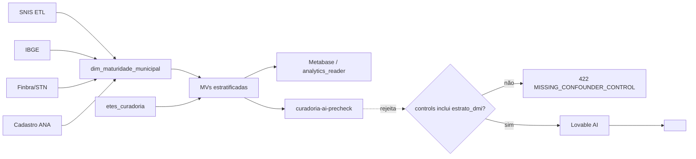

## Contexto

A ANA passará a editar normas com base em dados SNIS (financeiros, cobertura água/esgoto, saúde pública) de milhares de municípios. Duas ameaças convergem:

1. **Viés estatístico (Fantasma da Capacidade Institucional)**: correlações espúrias entre investimento em ETE e doenças hídricas porque IDH/porte do município confunde exposição e notificação.
2. **Cyber (RPC Senate, mai/2022)**: sistemas de água/esgoto são "national critical functions"; ataques via acesso remoto (CA/FL 2021) exploram protocolos frouxos. Como a plataforma passa a influenciar norma pública, ela vira alvo — integridade dos dados e trilha auditável são requisitos regulatórios, não conforto.

Aplico as duas frentes no módulo Curadoria/Compliance existente (`etes_curadoria`, `sasb_datasets`, `curadoria-ai-precheck`, MVs Metabase).

---

## Frente 1 — Regra do "Falso Afluente" (anti-confounding)

### 1.1 Dimensão de Maturidade Institucional (DMI)
Nova tabela `dim_maturidade_municipal` alimentada por ETL do SNIS + IBGE + ANA-cadastro:

| Coluna | Fonte | Uso |
|---|---|---|
| `municipio_ibge` (PK) | IBGE | join |
| `idh_m` | Atlas PNUD | percentil |
| `pop_estimada` | IBGE | faixa porte (P/M/G/Metro) |
| `receita_corrente_pc` | Finbra/STN | capacidade fiscal |
| `servidores_reg_local` | ANA/agências | governança |
| `snis_completude_pct` | SNIS | qualidade da notificação |
| `estrato_dmi` (enum: `A`..`E`) | derivado | **chave de estratificação** |
| `atualizado_em` | — | freshness |

`estrato_dmi` = quintil composto de (IDH×0,3 + receita_pc×0,3 + servidores×0,2 + completude×0,2). Persistido — não recalcular a cada query.

### 1.2 Guard-rail no `curadoria-ai-precheck` e em qualquer job de regressão/clustering

Contrato obrigatório para qualquer chamada analítica no pilar saneamento:

```ts
type AnalyticsRequest = {
  metric: string;                  // ex.: "invest_ete_vs_doencas_hidricas"
  controls: string[];              // DEVE conter "estrato_dmi" + "snis_completude_pct"
  stratify_by: "estrato_dmi";      // obrigatório
  min_group_size: 30;              // rejeita estratos com n<30
};
```

Edge function rejeita (HTTP 422, código `MISSING_CONFOUNDER_CONTROL`) qualquer requisição sem `estrato_dmi` em `controls`. Log em `analytics_guardrail_log` (quem, quando, métrica, motivo).

### 1.3 Normalização nas Materialized Views
`mv_dbo_regional`, `mv_cobertura_municipal` ganham partição por `estrato_dmi`. Metabase sempre mostra série **por estrato**, nunca agregado nacional cru para métricas de saúde.

### 1.4 UI — badge de confiabilidade
Componente `<ConfoundingBadge/>` em Compliance/Curadoria:
- 🟢 "Comparado dentro do estrato DMI-X (n=…)"
- 🟡 "Amostra pequena — inferência frágil"
- 🔴 "Sem controle de confusão — bloqueado para publicação normativa"

### 1.5 IA (Cortex-San + precheck)
System prompt ganha bloco fixo:
> "Nunca afirme causalidade entre variável de saneamento e desfecho de saúde sem citar `estrato_dmi` e `snis_completude_pct` da amostra. Se ausentes no contexto, responda que a análise é inconclusiva."

RAG-lite passa a incluir 1 snippet do `dim_maturidade_municipal` do(s) município(s) da pergunta.

---

## Frente 2 — Hardening inspirado no RPC Senate paper

Aplicável porque a plataforma agora influencia norma federal:

1. **Acesso remoto**: MFA obrigatório para `admin`/`gestor`/`auditor` (Supabase `aal2`); sessões >30 min de idle deslogam.
2. **Integridade de dados regulatórios**: hash SHA-256 do `payload` gravado em `formulario_respostas_audit` já existente; adicionar coluna `payload_sha256` + verificação no `curadoria-transition`. Qualquer divergência = alerta e bloqueio.
3. **Segregação**: role `analytics_reader` (só MVs, sem PII) separado de `metabase_reader` que já existe — Metabase usa só `analytics_reader`.
4. **Trilha de acesso a dados sensíveis**: log de todo SELECT em `dim_maturidade_municipal` via view + trigger em tabela `sensitive_access_log`.
5. **Rate-limit** no gateway de IA (`curadoria-ai-precheck`, `cortex-chat`) por usuário — teto duro, não best-effort.

---

## Diagrama lógico (Mermaid)



---

## Entregáveis por fase

### Fase 1 — Fundação de dados (migração + ETL stub)
- Migração: `dim_maturidade_municipal`, `analytics_guardrail_log`, `sensitive_access_log`, coluna `payload_sha256` em `formulario_respostas` + trigger.
- Seed inicial (top 50 municípios com dados públicos abertos) para destravar UI.
- GRANTs corretos + RLS (`authenticated` select, escrita só `service_role`).
- Doc: `docs/11-anti-confounding-dmi.md`.

### Fase 2 — Guard-rail server-side
- Novo edge function `analytics-guardrail` (validador central) e wrapper em `curadoria-ai-precheck` que o chama antes do LLM.
- Atualização do system prompt do Cortex-San + precheck com regra de causalidade.
- Testes vitest: request sem `estrato_dmi` → 422; com estrato e n<30 → 422; feliz → 200.

### Fase 3 — Analítica estratificada
- Reescrita das MVs `mv_cobertura_municipal`, `mv_dbo_regional` particionando por `estrato_dmi`.
- Nova MV `mv_saude_vs_saneamento_por_estrato` (join com dados de saúde quando disponíveis; até lá, view vazia com contrato pronto).
- Ajuste do `refresh_metabase_views()` + pg_cron.

### Fase 4 — UI/UX
- Componente `<ConfoundingBadge/>` + integração em ScoresTab, EvolucaoTab, painel de precheck da Curadoria.
- Filtro global "Estrato DMI" no Compliance.
- Alerta visual quando usuário tentar exportar/publicar métrica sem estrato.

### Fase 5 — Hardening cyber (RPC paper)
- MFA obrigatório para papéis staff (Supabase `configure_auth` + guarda em `ProtectedRoute`).
- Verificação de `payload_sha256` em `curadoria-transition`.
- Role `analytics_reader` + revogar acesso de `metabase_reader` a tabelas fonte.
- Rate-limit por usuário nos edge functions de IA.
- Atualização de `docs/09-seguranca.md`.

### Fase 6 — Governança
- `docs/12-governanca-analitica.md`: procedimento de revisão antes de publicar norma; quem assina; ciclo de re-treinamento do DMI.
- Painel `/admin/governanca` com últimas 100 tentativas bloqueadas pelo guard-rail.

---

## Riscos e decisões abertas

1. **Fonte dos dados de saúde**: DATASUS/SIH tem latência alta e viés de subnotificação — precisamos definir se puxamos direto ou dependemos de upload manual do MS. Sugiro começar com **campo vazio + contrato pronto** (Fase 3) e ligar depois.
2. **Cálculo do DMI**: pesos (0,3/0,3/0,2/0,2) são chute inicial. Recomendo publicar como parâmetro editável em `system_settings` para o time metodológico calibrar sem deploy.
3. **Escopo do MFA obrigatório**: pode atritar operadores municipais pequenos. Proposta: MFA obrigatório só para `admin`/`gestor`/`auditor`, opcional para `operador`.
4. **Municípios sem dados** (ex.: comunidades isoladas): entram em `estrato_dmi = 'E'` (menor confiança) e ganham badge 🔴 até coleta manual.

---

## O que quero confirmar antes de codar

- Começamos pela **Fase 1 + 2** (fundação + guard-rail server-side) neste primeiro ciclo? É o menor incremento que já bloqueia análises enviesadas em produção.
- Ok publicar os pesos do DMI como parâmetro editável (item de risco #2)?
- Escopo do MFA como descrito no item #3?
