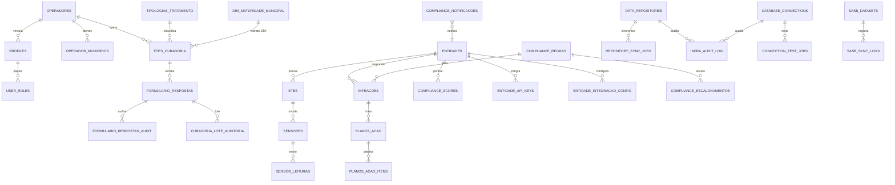
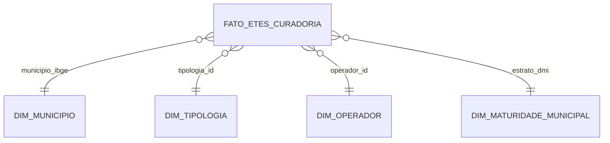

# 13 — Diagrama ER

## Star schema analítico

Todas as MVs (`mv_cobertura_municipal`, `mv_etes_por_tipologia`, `mv_dbo_regional`, `mv_saude_vs_saneamento_por_estrato`) derivam do fato e são refrescadas por `refresh_metabase_views()`.
